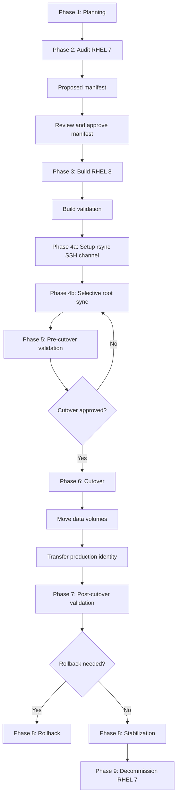

# Migration Workflow Diagram



## Repository Structure

```text
.
├── docs/
├── group_vars/
├── inventories/
├── lookup_tables/
├── playbooks/
│   ├── audit/
│   │   └── tasks/
│   ├── build/
│   ├── cutover/
│   ├── decommission/
│   ├── migrate/
│   ├── rollback/
│   ├── validate-post/
│   ├── validate-pre/
│   └── validate-shared/
├── roles/
└── schemas/
```
